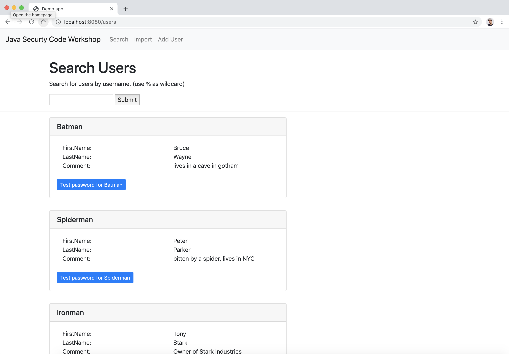
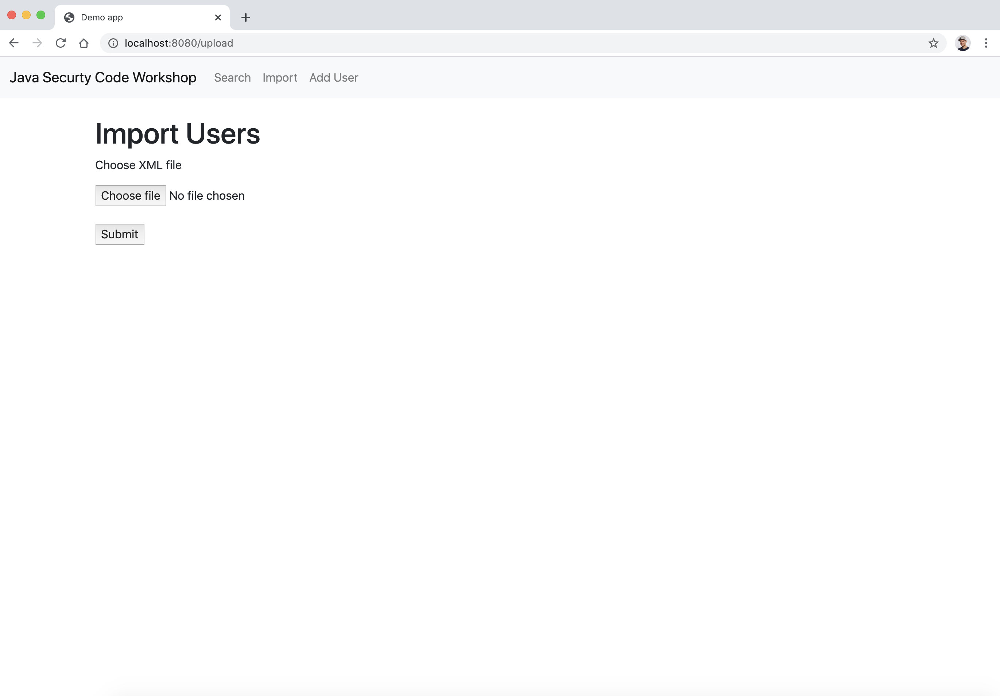
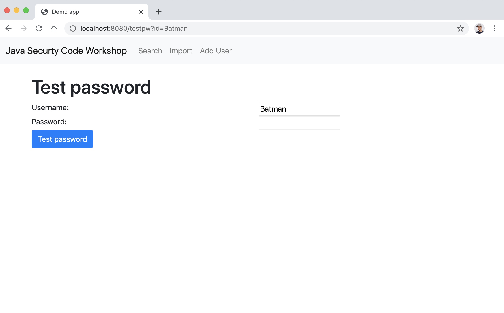

# Java Security Code Workshop
In this step by step workshop, you'll learn how to exploit this Java application and the code changes you need to make to fix it.

## Required software
- Java 8
- Maven
- Browser (preferably Chrome)
- IDE / Code editor

# Introduction

This workshop contains a demo Java application build on with Spring boot and Thymeleaf.
It contains a number of security issues in the source code.
During this workshop, you will locate, exploit and fix the vulnerabilities in this application.

The vulnerabilities covered in this workshop:
- XML External entity injection (XXE)
- SQL injection
- Cross-site scripting (XSS)
- Encryption
- 

## Installation

- Check out the repository
- go to the `java-code-workshop` folder
- Run `mvn clean package`
- Run `mvn spring-boot:run`

Alternatively, you can run this Spring boot app from your IDE if you wish to do that.

## Application
When your application is running you can access it at [http://localhost:8080/](http://localhost:8080/)

This application allows you to search through a user database and allows you to do some basic admin tasks on that.
Play around for a bit to see how it works.

# Assignments

## Assignment 1 Search

On the Search page, you can search the users by **username**.
By using a `%` you can provide wildcards. For instance `Super%` will give you the result for **Superman**
Using the search term `%man`

### 1a Try to create a search phrase that searches for the **firstname** 'Bruce'

    
Click to see [Hint 1](hints/search/hint1.md)

Click to see [Hint 2](hints/search/hint2.md)

    
### 1b Try to override every **lastname** with 'EVIL'
    
Click to see [Hint 3](hints/search/hint3.md)

Click to see [Hint 4](hints/search/hint4.md)
    
### 1c Fix the vulnerability

Click to see [Hint 5](hints/search/hint5.md)

Click to see [Hint 6](hints/search/hint6.md)

Click to see [Hint 7](hints/search/hint7.md)

## Assignment 2 Import

On the import page, you can import new users by using an XML.
We already created a sample XML file `users.xml` that you can use to import new users

### 2a import new users using the `user.xml` file.
### 2b edit the file so we can read the `etc/passwd` file on your machine (or any other file for that matter)

Click to see [Hint 1](hints/import/hint1.md)

Click to see [Hint 2](hints/import/hint2.md)

Click to see [Hint 3](hints/import/hint3.md)

Click to see [Hint 4](hints/import/hint4.md)

Click to see [Hint 5](hints/import/hint5.md)

Click to see [Hint 6](hints/import/hint6.md)

### 2c Fix the vulnerability

Click to see [Hint 7](hints/import/hint7.md)

Click to see [Hint 8](hints/import/hint8.md)

## Assignment 3 Add User

On the *Add User* page you can manually add new Users
This is quite straight forward.

### 3a Try to insert a new user using the form.
### 3b Try to do a code insertion when creating a new user.

Click to see [Hint 1](hints/adduser/hint1.md)

Click to see [Hint 2](hints/adduser/hint2.md)

### 3c Try to display the token of a user that is on the page

Click to see [Hint 3](hints/adduser/hint3.md)

Click to see [Hint 4](hints/adduser/hint4.md)

We just proved that we can execute code in the user’s browser.     
We also showed that we can simple access and display the cookie. Imagine that we send this token in the cookie to another website and take over your session?

### 3d Fix this by sanitizing the input before it enters the database

Click to see [Hint 5](hints/adduser/hint5.md)

Click to see [Hint 6](hints/adduser/hint6.md)

Click to see [Hint 7](hints/adduser/hint7.md)

Click to see [Hint 8](hints/adduser/hint8.md)

### Assignment 4 passwords

Password of the users are stored in plain text. This is not recommanded as the passwords are readible by default.
For storing password it is recommanded to use a strong cryptographic hashing function.

In short: a hashing function is a one-way 'encryption' function that transforms a String into a fixed sized sequence of characters (the hash).
The function is irriverable so you cannot use the function to recover the orignal Sting.
A cryptographic hashing function is a hashing function that is suitable for cryptographic perposes. More info ...

### 4a Create a function `encodePassword(String)` in `PasswordUtil` that uses BCrypt to encode passwords.

Click to see [Hint 1](hints/password/hint1.md)

Click to see [Hint 2](hints/password/hint2.md)

Click to see [Hint 3](hints/password/hint3.md)

### 4b Make sure that the password for a User is not stored, instead store BCrypt hash

Click to see [Hint 4](hints/password/hint4.md)

Click to see [Hint 5](hints/password/hint5.md)

### 4c Fix text password

You can test the password of a user by clicking the blue "Test password ..." button in the Search page.
A new page will open where you can enter the original password. Make sure that this functionality works again.

Click to see [Hint 6](hints/password/hint6.md)

Click to see [Hint 7](hints/password/hint7.md)

### 4d Increase the strenght the password encoder to 15

Click to see [Hint 8](hints/password/hint8.md)

 

 
